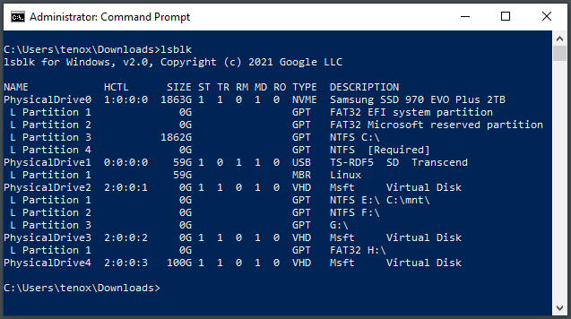

# lsblk for windows

Similar to Linux *lsblk(1)* but for Windows.

The latest version supports printing drive letters, mount points and filesystem types.



Download under [releases](https://github.com/tenox7/lsblk/releases)

For a similar more native Windows utility see [listdisk](https://github.com/tenox7/listdisk)

Explanation of header columns:

```
ST - Status (1=healthy, 0=unhealthy)
TR - Trim/Unmap/Discard capability support
RM - Removable media (1=yes, 0=no)
RO - Read only (1=yes, 0=no)
```

Flags:

```
-n - do not list, query and print volumes, drive letters and mount points
-d - debug output
```
